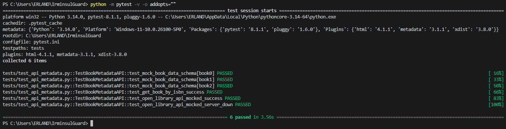
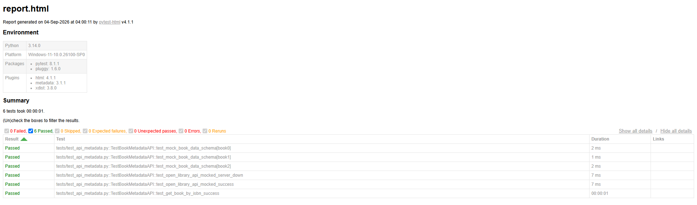

# 🌳 IrminsulGuard - Library Metadata & API Automation Suite


An automated QA testing suite designed for validating bibliographic catalog metadata and API endpoint reliability for digital library systems.

---

## 📌 1. Executive Summary

This automated testing project is built to validate system reliability across two primary core layers:

1. **API Layer:** Integration with public catalog endpoints (e.g., Open Library API) for dynamic schema validation, HTTP response verification, and network fault tolerance.
2. **Metadata & Bibliographic Layer:** Custom regex validation rules enforcing international library standards, including **MARC21** (ISBN-10 & ISBN-13) and **Dewey Decimal Classification (DDC)** formatting.

All test scenarios utilize **Data-Driven Testing (DDT)** architecture, where bibliographic records and assertions are isolated into independent JSON datasets (`mock_books.json`) without hardcoded values in the execution scripts.

---

## 💡 2. Problem Statement & Real-World Impact

In real-world library operations, managing large-scale Online Public Access Catalog (OPAC) systems and digital repositories often presents significant operational challenges:

* **Human Error in Data Entry:** Librarians and data entry staff frequently face human fatigue, leading to mistyped ISBNs, missing digits, or malformed DDC classification codes during cataloging.
* **Corrupted Search & Discovery:** Invalid catalog metadata directly disrupts search indexing. A single wrong character in an ISBN or DDC notation can make a newly acquired academic book "invisible" to students and researchers.
* **Unreliable Third-Party Integrations:** Modern libraries rely heavily on external REST APIs (such as Open Library, WorldCat, or national union catalogs). Unhandled API timeouts or unexpected schema changes from external providers can crash local catalog search interfaces.

### How IrminsulGuard Solves This:
**IrminsulGuard** serves as an automated quality gate between cataloging input and live database indexing:
* **Automated Metadata Audit:** Replaces manual catalog checking by instantly validating incoming bibliographic data against international MARC21 and DDC standards.
* **Resilient API Monitoring:** Ensures that external catalog API failures or network latency are handled gracefully without breaking library patron workflows.
* **Time Efficiency:** Reduces the manual audit workload for cataloging librarians, allowing them to focus on collection development rather than routine data verification.

---

## 🛠️ 3. Key Features

* **Bibliographic Metadata Integrity:** Dedicated regex validator (`MARC21Validator`) enforcing international library standards for ISBN-10/13 formats and Dewey Decimal Classification (DDC) notations.
* **Hermetic API Testing & Mocking:** Open Library REST API integration tests with isolated offline network mocking (`responses`) for fault tolerance (handling 200 OK and 500 Server Errors).
* **Parallel Test Execution:** Optimized multi-threaded test runner powered by `pytest-xdist` to accelerate test execution across CPU cores.
* **Containerized Environment:** Fully dockerized setup using `Dockerfile` and `docker-compose.yml` for zero-configuration, environment-agnostic test runs.
* **Automated CI/CD:** Fully integrated GitHub Actions workflow (`test-pipeline.yml`) executing parallel test suites automatically on every `push` and `pull_request`.

---

## ⚙️ 4. Installation & Usage Guide

### Prerequisites
* **Python**: 3.11 or higher
* **Git**: Installed and configured
* **Docker & Docker Compose** *(Optional, for containerized execution)*

### Step 1: Clone the Repository
`git clone https://github.com/erlandfauzan/IrminsulGuard.git`
`cd IrminsulGuard`

### Step 2: Set Up Virtual Environment (Recommended)
First, create the virtual environment:
`python -m venv venv`

Next, activate it based on your operating system:
* **Windows (PowerShell/CMD):** `venv\Scripts\activate`
* **macOS / Linux:** `source venv/bin/activate`

Create a `.env` file in the root directory (or use default configuration):

<pre><code>BASE_URL=https://openlibrary.org
TIMEOUT=5</code></pre>


### Step 3: Install Dependencies
`python -m pip install --upgrade pip`
`python -m pip install -r requirements.txt`

### Step 4: Execute Test Suite & Generate Reports
Option A: Local Execution (Parallel Testing Enabled)
To run all automated test cases in terminal:
`python -m pytest`

To run and generate an interactive, self-contained HTML visual report:
`python -m pytest --html=report.html --self-contained-html`

Option B: Docker Execution (Containerized)
To run the entire test suite inside an isolated Docker container:
`docker compose up --build`

---

## 🌲 5. Origin & Naming Lore
In the lore of *Genshin Impact*, **Irminsul** is a majestic silver-white tree connected to all ley lines in Teyvat. It acts as a universal knowledge repository recording every piece of history, memory, and information. However, corrupted records within Irminsul can alter knowledge and destabilize reality.

**IrminsulGuard** draws inspiration from this concept. Designed for digital library ecosystems, it serves as a QA automation sentinel that validates bibliographic catalog metadata and ensures API endpoint reliability. By catching invalid ISBNs, bad DDC formatting, and API anomalies, **IrminsulGuard** maintains the integrity of modern library knowledge systems.

---

## 📊 6. Test Execution Evidence

### 1. Terminal Execution Log


### 2. Interactive HTML Report


---

## 7. Repository Structure

* `.github/workflows/test-pipeline.yml` - GitHub Actions CI/CD Pipeline
* `assets/` - HTML Report & Terminal Execution Screenshots
* `config/` - Configuration Directory
* `data/mock_books.json` - Mock Bibliographic Dataset
* `pages/` - Page Object Model (POM) Modules
* `tests/test_api_metadata.py` - Pytest Integration & Hermetic API Mocking Test Suite
* `tests/test_ui_search.py` - Library Catalog UI Search Automation
* `utils/marc_validator.py` - Custom MARC21 & DDC Validator
* `.env` - Local Environment Variables
* `.gitignore` - Git Exclusion File
* `CONTRIBUTING.md` - Contribution Guidelines
* `docker-compose.yml` - Docker Compose Orchestration
* `Dockerfile` - Containerization Configuration
* `LICENSE` - MIT Open Source License
* `pytest.ini` - Pytest Configuration & Parallel Execution Settings
* `README.md` - Project Documentation
* `report.html` - Generated Test Report
* `requirements.txt` - Project Dependencies
* `TEST_PLAN.md` - Comprehensive QA Test Strategy Document

---

## ⏳ 8. Architecture & Test Flow Diagram

The diagram below illustrates the end-to-end execution workflow of the testing suite from data ingestion to CI/CD pipeline triggers:

```mermaid
flowchart TD
    subgraph Data Layer
        A[JSON Mock Data<br/>data/mock_books.json]
        A2[Config Files<br/>config/]
    end

    subgraph Execution Layer
        B[Pytest Test Runner]
    end

    subgraph Validation Engine & Page Objects
        C[MARC21Validator Module<br/>utils/marc_validator.py]
        D[Requests HTTP Client]
        D2[Page Object Model<br/>pages/]
    end

    subgraph Test Scenarios
        E[API Metadata Tests<br/>tests/test_api_metadata.py]
        F[UI Search Automation<br/>tests/test_ui_search.py]
    end

    subgraph Reporting & CI/CD
        G[Console Test Logs]
        H[Pytest HTML Report<br/>report.html]
        I[GitHub Actions Pipeline<br/>.github/workflows/]
    end

    A --> B
    A2 --> B
    B --> C
    B --> D
    C --> E
    D --> D2
    D2 --> F
    E --> G
    F --> G
    G --> H
    H --> I